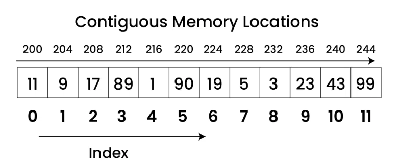

## Arrays: The Foundation of Data Structures 🧱

An Array is a **linear data structure** that stores a collection of elements. The key characteristics are:
* All elements must be of the **same data type** (e.g., an array of integers, an array of strings).
* Elements are stored in **contiguous memory locations**, meaning they are placed one after another in memory.
* Each element is identified by an **index**, which is typically a number. In most programming languages, array indexing starts at **0**.
* The size of a traditional array is **fixed** when it's created.

Think of an array like a row of numbered mailboxes. Each mailbox can hold one letter (the data), and you can find any letter quickly if you know its mailbox number (the index).

***Note: Understand Flow via Code in `array.c`***

---

## Repesentaion of Array

---

## Common Array Operations & Algorithms

Here are the fundamental operations you can perform on an array, along with their basic algorithms. Let's assume we have an array named `A`.

* **Traversal**
    * **Goal:** To visit and process each element in the array exactly once.
    * **Algorithm:**
        1.  Start from the first element (index 0).
        2.  Go to the next element.
        3.  Repeat until the last element has been visited.

* **Insertion**
    * **Goal:** To add a new element at a specific index.
    * **Algorithm (to insert `element` at `index`):**
        1.  Check if there is space in the array.
        2.  Shift all elements from `index` to the end one position to the right.
        3.  Place the new `element` at the given `index`.

* **Deletion**
    * **Goal:** To remove an element from a specific index.
    * **Algorithm (to delete from `index`):**
        1.  Shift all elements from `index + 1` to the end one position to the left. This overwrites the element at `index`.
        2.  Decrease the count of total elements in the array.

* **Searching**
    * **Goal:** To find the index of a specific element.
    * **Linear Search Algorithm:**
        1.  Start from the first element (index 0).
        2.  Compare the current element with the target element.
        3.  If they match, return the current index.
        4.  If not, move to the next element and repeat.
        5.  If the element is not found after checking all elements, indicate failure.
    * **Binary Search Algorithm (requires a sorted array):**
        1.  Compare the target element with the middle element of the array.
        2.  If they match, the search is successful.
        3.  If the target is smaller, repeat the search in the left half of the array.
        4.  If the target is larger, repeat the search in the right half of the array.
        5.  Continue until the element is found or the subarray size becomes zero.

* **Update**
    * **Goal:** To change the value of an existing element at a specific index.
    * **Algorithm:**
        1.  Go to the desired `index`.
        2.  Replace the old value at that `index` with the new value.

---

## Key Properties

* **Homogeneous:** Stores elements of the same type.
* **Indexed:** Elements are accessed using a numerical index (e.g., `A[0]`, `A[1]`, `A[2]`).
* **Contiguous Memory:** Elements are stored side-by-side in memory, which helps in fast access.
* **Static Size:** Traditional arrays have a fixed size defined at creation.

---

## Advantages of Using Arrays 👍

* **Fast Random Access:** You can access any element directly using its index in constant time, $O(1)$. This is the biggest advantage.
* **Memory Efficiency:** No extra memory is needed to store pointers or links between elements, making them space-efficient.
* **Simplicity:** They are easy to understand and implement.

---

## Disadvantages of Using Arrays 👎

* **Fixed Size:** You must specify the size beforehand. If you allocate too much memory, it's wasted. If you allocate too little, you can run out of space.
* **Costly Insertions/Deletions:** Adding or removing an element in the middle of an array is slow because you have to shift all subsequent elements, taking $O(n)$ time.

---

## Applications

* Implementing other data structures like **stacks, queues, heaps, and hash tables**.
* Storing lists of data where the size is known, like the number of days in a month.
* Used in various **sorting algorithms** such as bubble sort, insertion sort, and quick sort.
* Representing **matrices and tables** using 2D or multi-dimensional arrays.
* Image processing, where an image is treated as a 2D array of pixels.

---

## Time Complexity Analysis ⏱️

Time complexity describes how the runtime of an operation grows with the number of elements ($n$) in the array.

| Operation | Average Case | Worst Case | Explanation |
| :--- | :--- | :--- | :--- |
| **Access (by index)** | $O(1)$ | $O(1)$ | You can jump directly to any index. |
| **Search (Linear)** | $O(n)$ | $O(n)$ | You might have to check every element. |
| **Search (Binary)** | $O(\log n)$ | $O(\log n)$ | The array must be sorted. You halve the search space each time. |
| **Insertion** | $O(n)$ | $O(n)$ | You may need to shift all elements. |
| **Deletion** | $O(n)$ | $O(n)$ | You may need to shift all elements. |

---

## Important Additional Information

### Types of Arrays

* **One-Dimensional (1D) Array:** A simple linear list of elements.
    * Example: `int scores[] = {95, 88, 72, 99};`
* **Two-Dimensional (2D) Array:** An "array of arrays," often used to represent grids or matrices. You need two indices (row and column) to access an element.
    * Example: A Tic-Tac-Toe board. `char board[3][3];`
* **Multi-Dimensional Array:** An array with more than two dimensions (e.g., 3D, 4D). Used for more complex data representations.

### Dynamic Arrays

To overcome the "fixed size" limitation, most modern languages provide **dynamic arrays** (like `ArrayList` in Java/C#, `vector` in C++, or `list` in Python).

* **How they work:** A dynamic array is built on top of a regular array. When it gets full, it automatically creates a new, larger array (often double the size), copies all the old elements over, and then adds the new element.
* **Benefit:** They provide the flexibility of growing and shrinking on demand.
* **Trade-off:** The resizing operation can be slow ($O(n)$), but it happens so infrequently that the *average* time for adding an element is still very fast (amortized constant time, $O(1)$).